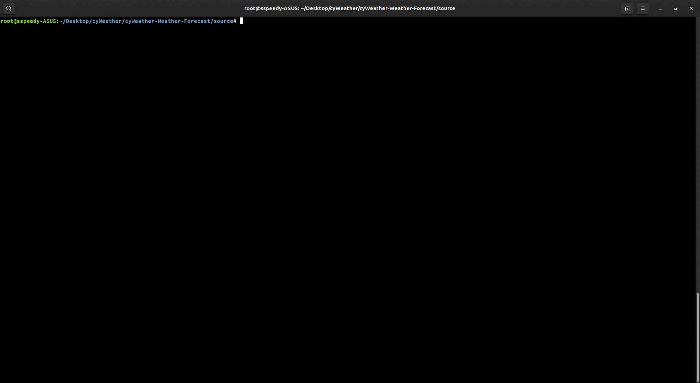

# CyWeather

CyWeather is a command line real-time weather application written in C++.

## Working



This will take only input a string as a city name, then it checks in the cities.txt file if it is present then it will request an API call to [Accuweather's Weather API](https://developer.accuweather.com/apis). Then it will store that JSON data in a file and then after parsing that data, it will assign it to DailyForecast object.

## External Libraries

In order to understand how the API requests work in C++, and how we are parsing JSON object in C++ object please have a look at these following libraries.

[JSON for modern C++](https://github.com/nlohmann/json).

[cURLpp](https://github.com/jpbarrette/curlpp/).


## Installation and Compilation

To install the JSON library and cURLpp library, run these scripts 

```bash
 sudo apt install nlohmann-json-dev 
 sudo apt install curl
```

Fork the cURLpp library and dynamic link them to the source code while compiling.
```C
g++ -std=c++11 -I/usr/local/include json_ex.cpp -L/usr/local/lib -lcurlpp -lcurl -lssl -lcrypto -o json_ex

./json_ex
```


## Usage

```C++
#include <nlohman/json.hpp>
#include <cURLpp/Options>
using json = nlohmann::json;
fstream file_pointer;

//Return JSON data from the API,and store into the file 'data.json'.
file_pointer.open("data.json");
file_pointer<<curlpp::options::Url("http://dataservice.accuweather.com/locations/v1/cities/search?apikey=eHmyUvaR0JwzYpejDI9AOXq5mBVGMAzI&q=Gadag")<<endl;
file_pointer.close()

//Parsing the JSON data into C++ object.
std::ifstream i("data.json");
json j = json::parse(i);
```

## Contributing
Pull requests are welcome. For major changes, please open an issue first to discuss what you would like to change.

Please make sure to update tests as appropriate.

## License
[MIT](https://choosealicense.com/licenses/mit/)